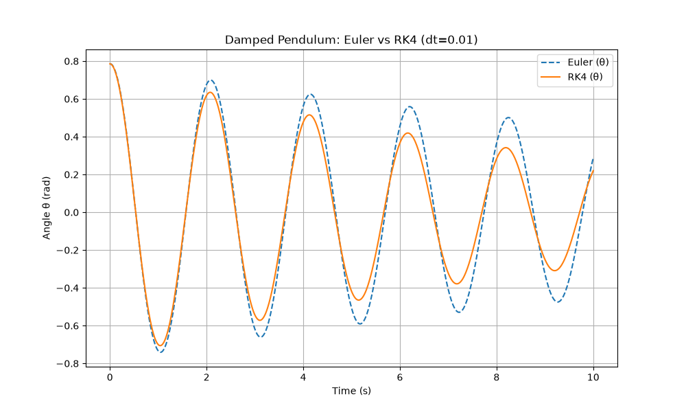
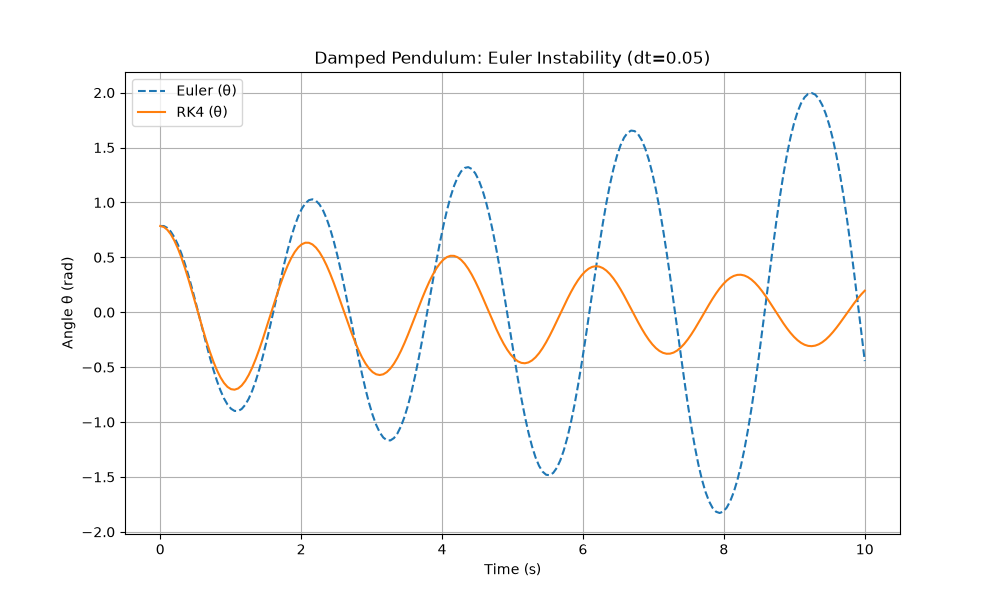
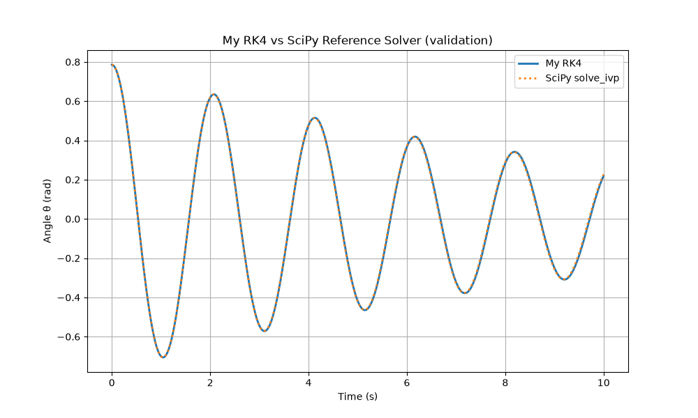

# Damped Pendulum ODE Solver: Euler vs RK4

Applies and compares two numerical methods for solving the damped pendulum's equation of motion, validated against SciPy's solve_ivp.

## Motivation
Built as a foundation for a future project - a self balancing robot — numerical integration and control-relevant simulation are important with regards to real-time sensor and control systems in aerospace and robotics.

## Method
- Reformulated the pendulum's 2nd-order ODE as a coupled first-order system
- Implemented Euler's method and 4th-order Runge-Kutta (RK4) from scratch
- Compared accuracy and stability at varying step sizes
- Validated RK4 against SciPy's solve_ivp reference solver

## Results
At dt=0.01, both methods closely agree with each other and with SciPy.
At dt=0.05, Euler's method becomes numerically unstable — the simulated
pendulum gains energy over time despite damping, which is physically
impossible. RK4 remains stable and accurate at both step sizes.

## Project structure
- `pendulum.py` — physics model (equation of motion)
- `solvers.py` — Euler and RK4 numerical integration methods
- `main.py` — runs simulations and generates plots

## Run it
pip install -r requirements.txt
python3 main.py